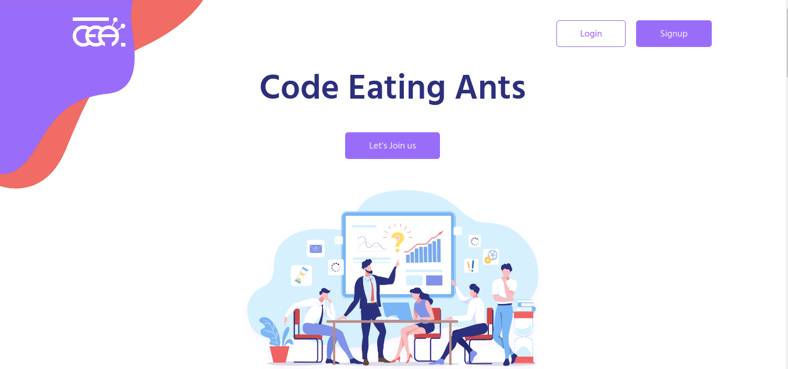

# Code Eating Ants - Homepage




## ডেভেলপমেন্ট

প্রথমে NodeJS ও Yarn ইন্সটল করে নিন, এবং প্রজেক্টটি ক্লোন করুন। এরপর নিচের ধাপগুলো অনুসরণ করুন।

১ - ডিপেন্ডেন্সিগুলো ইন্সটল করুন
```
yarn
```

২ - ডেভেলপমেন্ট মোডে চালু করুন
```
yarn start
```

ব্রাউজারে http://127.0.0.1:1234/ লিংকটি ওপেন করুন। সবকিছু ঠিকঠাক থাকলে আপনি ওয়েবসাইটটি দেখতে পারবেন। 

৩ - বিল্ড করতে
```
yarn run build
```

সবকিছু dist ফোল্ডারে জমা হবে।

**#হ্যাপি_কোডিং :)**
